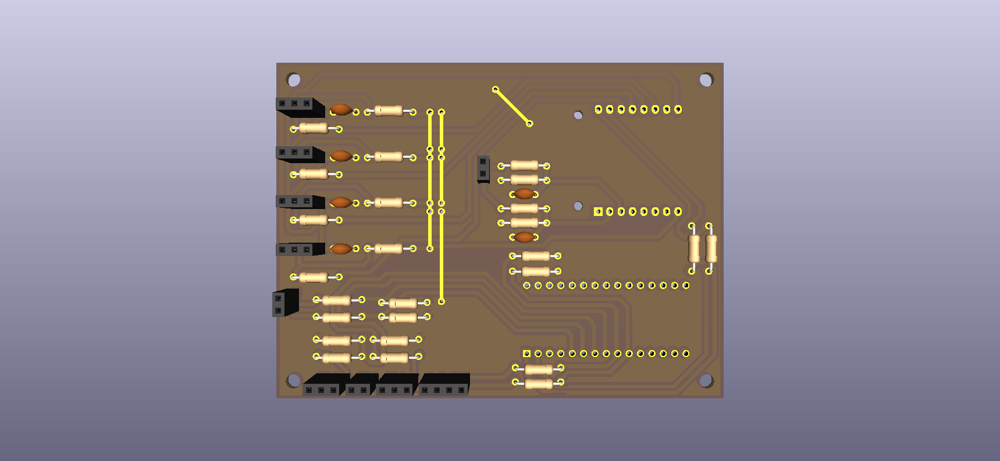
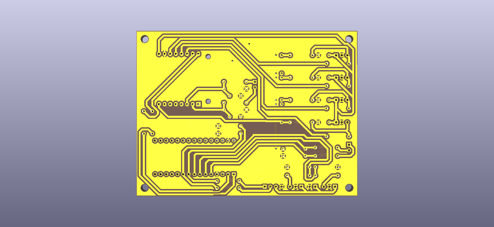

# Ava
*Autonomous Vehicle for Alex*
## Goal
Autonomous 1:10 RC-Car utilizing a Jetson Orin System.

## Hardware

### Custom PCB
All the different ECUs and sensors need to be connected.
Point-to-point wiring is one option but very messy and prone to EMI, using a custom PCB instead.

